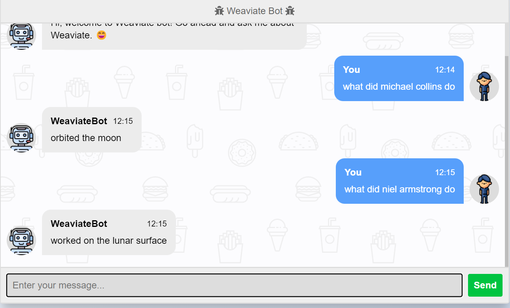
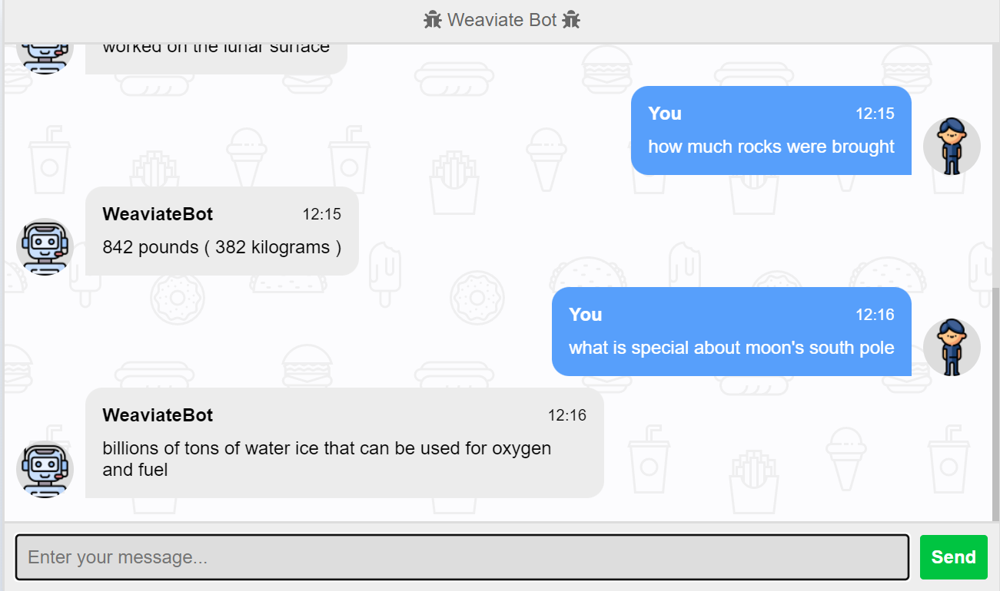

**This example makes use of the [qa-module](https://weaviate.io/developers/weaviate/v1.11.0/reader-generator-modules/qna-transformers.html) of weaviate to make a chatbot/FAQ-bot/INFO-bot**   

To run the example, setup an environment using the requirements.txt file and perform the following steps: 
1. Run "docker-compose up -d" in the same directory as the example. 
2. Run the command "python qa.py" to add data to weaviate. 
3. Run the command "python app.py" to start the flask server and use the interface."  

Below are some screenshots of the bot:  
The interface shown below will be available at "http://<YOUR_IP_ADDRESS>:5000/chatbot"  
Asking questions based on texts that we uploaded to weaviate.  
  

You can add the texts of your choice to the qa.py file. For demonstration purposes, I have used Apollo missions as a topic on which we can chat with the bot. 
Feel free to reach out if you run into any errors using this example. 
Have a great time using weaviate !! 😇😇