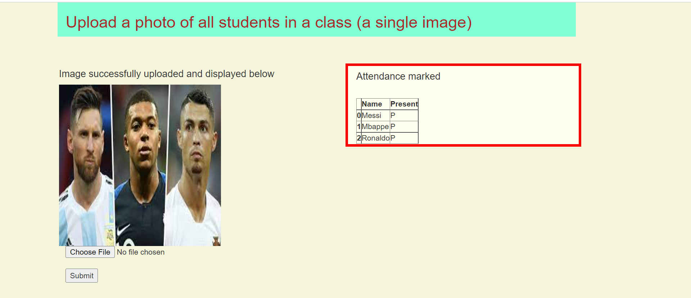
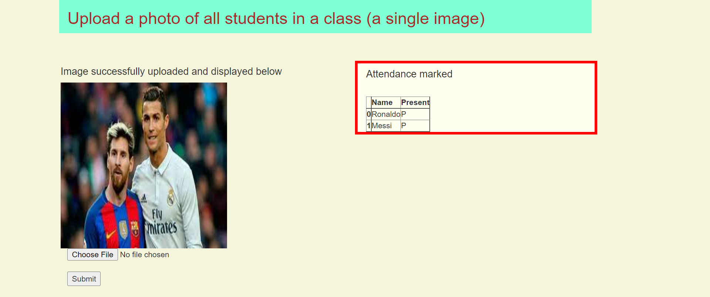

**This is an attendance system made using OpenCV and weaviate vector search engine and database.** 
Note: I have used images of football players like Messi, Ronaldo and Mbappe for demonstration.
Due to privacy concerns of my classmates, I could not upload here a demo of this in an actual class of 
students.   
Why we need this ?  
A lot of time needs to be spent on taking attendance of a class and marking it. Also, it costs a lot 
if biometric systems are used. This system eases this problem by allowing the instructor to just click one
picture of the entire class and the rest is done by the system.  
Fun fact: It also saves the instructor from getting fooled by proxies 😂 !!   

How does it actually solve the problem ? 
When we upload a picture of the class, the openCV code breaks down and separates faces from that picture and sends them one by one to our weaviate instance for inference.
Then our weaviate instance, which already contains images of all students of the class in separate folders
uses its image2vec-neural module to classify each of those and give a label(name of student) to those images.
(We can also use our own vectorizer, like in the student_own_add.py file) 
We then simply mark the returned names as present and rest as absent in our dataframe and save to a csv file.  

Why is is not costly like other systems ? 
Because the softwares that we use to make this system are all open source (meaning, you can use and alter them as you want), and also we only need a PC and a camera (any camera is fine) to make this work, it is very easy to set this up in schools and colleges.
  

How to use this code? 
1. In the students directory, make directories by name of each student. 
2. In those individual student directories, add some images of the corressponding student. 
3. Setup your environment using the requirements.txt file.
4. Spin up your weaviate instance by using the docker-compose.yml file. 
5. Run the student_add.py file to load the students images to weaviate. If you want your own vectors, use the 
student_own_add.py file instead. It contains code that maps each face to an embedding/vector which we can
store in weaviate. 
6. Then, click a picture of your class and save it. 
7. Run the upload_student.py file to start the flask server and use the interface. 
8. Upload photo of entire class and click on submit. You will be shown with the names which are present. 

Below are some screenshots of the demo: 

Three of them are present here. 

  
Two of them are present here. 

  
Below is the video of the demo of this system. 
https://user-images.githubusercontent.com/84656834/166136342-16cfa1cc-5dc5-4e1b-8ade-9e3a26d2fc59.mp4
