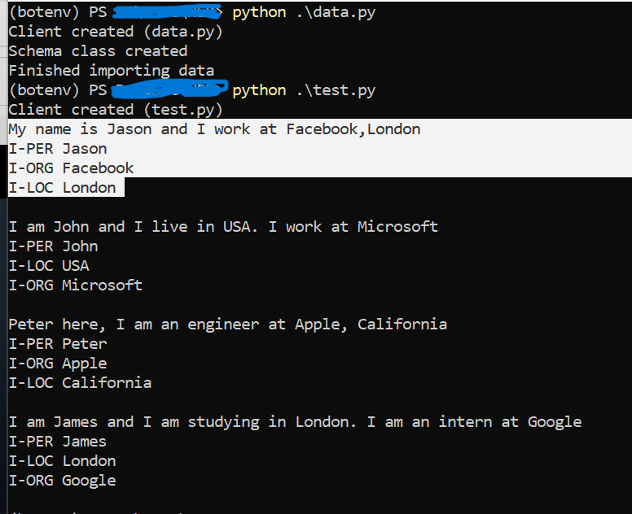

This is a very easy-to-use and simple example(terminal based) of the weaviate [Named Entity Recognition](https://weaviate.io/developers/weaviate/v1.11.0/reader-generator-modules/ner-transformers.html) module. 

In this example, we have some sentences (can be from any source, like all introductory sentences from a slack channel) and we extract entities like person name, location, organization from those and collect the data in a file. This can be used to collect useful data from conversations, emails, messages etc.

To run the example, make sure to have docker and docker-compose and start/spin-up the weaviate instance using the command: 
"docker-compose up -d" (Run this in same directory as the project)  

Now, run the data.py file using "python ./data.py" to load the data in weaviate. 
Then run the command "python ./test.py" to test if all works well. (Optional)  
Then run the command "python ./add.py" to add the data (the extracted entities) to the csv file. 

Below is the result of the test.py file: 
