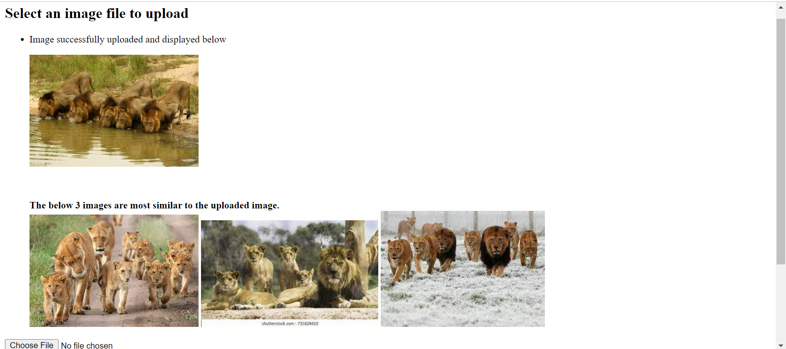
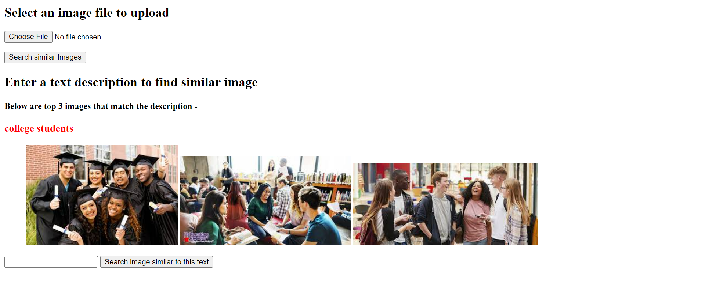

This is an example created using the weaviate [multi2-vec-clip](https://weaviate.io/developers/weaviate/v1.11.0/retriever-vectorizer-modules/multi2vec-clip.html) module and the weaviate-python client.

NOTE: A similar example which makes us of [multi2-vec-clip](https://weaviate.io/developers/weaviate/v1.11.0/retriever-vectorizer-modules/multi2vec-clip.html) already exists in [here](https://github.com/semi-technologies/weaviate-examples/tree/main/clip-multi-modal-text-image-search). I have referred to that example and created this example for those comfortable in python and flask than shell scripting or React. I am very thankful to the contributors who made that example. In this example, user will have an option to search with a text query or an image query. Also, the results can be image or text depending on the embedding similarity of query and result.

This example has a flask based interface where a user can give an image or text as a query and the top 3 images that are similar to the given image or text are returned to the user. (The number of results needed can be altered. You can even fetch only the result with the highest similarity)

To run this example, you need to have docker installed and some knowledge of using docker-compose and basic docker commands will be helpful. 
Spin up your weaviate instance using the docker-file in this directory by using the command "docker-compose up -d".  
The "docker-compose.yml" file has been made using the configurations given on the above mentioned web page.  
To run the python codes, use the requirements.txt file to setup your environment. 

After spinning up weaviate and getting the environment ready, follow the below steps: 
1. To add data to weaviate, run "python .\data.py" (command for windows)  
2. To test if everything is workin, run "python .\terminal_test.py"  
3. Now, run "python .\upload.py" to start the flask server and use the frontend.

Below are screenshots of the results obtained on image and text queries:

1. When the model is given an Image as a query:

The similarity in the above images is that all of them contain a pride of lions (group of lions).
 

2. When the model is given a Text as a query:

Another example with a text query..

To add more images, navigate to "static/Images" folder and put your images there and run the "data.py" file.
Similarly, to add more tests, add images to "static/Test" folder.
To add more texts, add them in the list named "texts" in "data.py" file and run that file.

NOTE: I have commented out the part where text can also be added to weaviate. But you can uncomment it and try adding text too.  
After adding text, the results may also contain text and images both, for a particular query. 
Experimenting with the type of input and observing the different types of results obtained is highly encouraged !! 
Have a great time with weaviate !! 